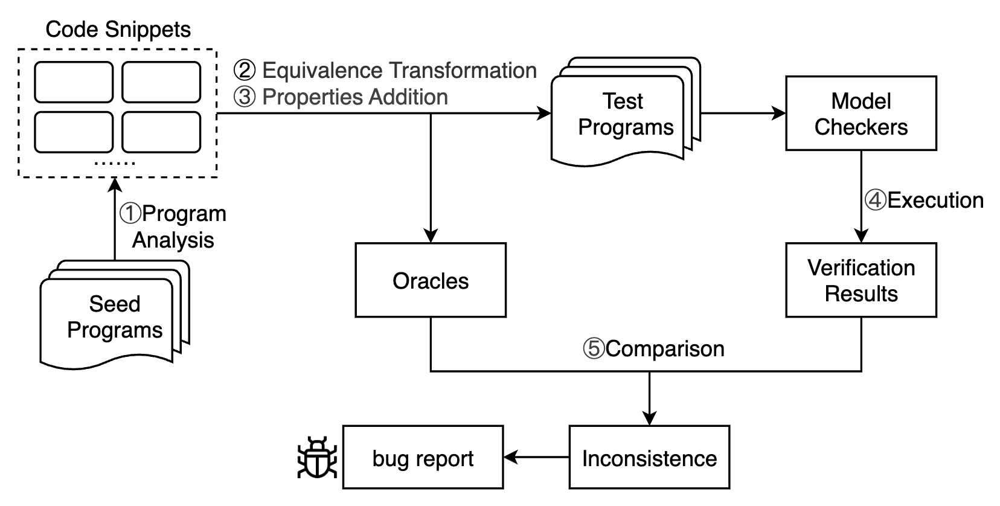

# Model Checker Testing
Based on the metamorphic testing paradigm, we explore
the usefulness of optimization-guided equivalence transformations for validating software model checkers in this paper. In particular, we propose a general testing approach that involves four major steps: 1) perform program analysis to select particular code snippets that meet specific transformation conditions; 2) apply optimization-guided equivalence transformations to the selected code snippets to get new code snippets; 3) embed the equivalence relations between variables in the original and transformed code snippets as properties to be verified within the program (i.e., create effective test cases); 4) validate the test programs with the model checker and compare the actual verification results with the expected ones. If discrepancies are found, it indicates potential bugs in the software model checker. The detailed process is illustrated in the figure below. 



We use gcc regression testcases as seed programs. 

# Structure of the project

```
Core operations is under the main folder:
|-- model_checker_test
| |-- TestCBMC # The CBMC test workflow implementation
| | |-- Main/Main.java # The entrance of CBMC testing
| | |-- Tools/TestCBMC.java # The CBMC command execution implementation
| |-- TestCPAchecker # The CPAchecker test workflow implementation
| | |-- Main/Main.java # The entrance of CPAchecker testing
| | |-- Tools/TestCPAchecker.java # The CPAchecker command execution implementation
| |-- TestSeahorn_singleton # The SeaHorn test workflow implementation
| | |-- Main/Main.java # The entrance of SeaHorn testing
| | |-- Tools/TestSeahorn.java # The SeaHorn command execution implementation

|-- test_case_generation
| |-- ASTInformation # The ast analysis implementation directory
| |-- Condition # The conditional structures transformation implementation directory
| |-- DataFlow # The conditional dataflow transformation implementation directory
| |-- test # The overall testing process execution implemention directory
| | |-- Mutate.java  # The entrance of test case generation process
```

# Usage

### Step 1: Install necessary packages

- Ubuntu >= 20
- Java >= 17
- CPAchecker (Please install it following [CPAchecker](https://cpachecker.sosy-lab.org/download.php))
- CBMC (Please install it following [CBMC](https://github.com/diffblue/cbmc))
- SeaHorn (Please install it following [SeaHorn](https://github.com/seahorn/seahorn))
- Clang >= 14
- Add file `libsigar-amd64-linux.so` into `/usr/lib` and `/usr/lib64`

### Step 2: Test clang ast analysis functionality

Assuming there is a program test.c:
```
#include <stdio.h>

int add(int a, int b) {
  return a + b;
}

void main() {
  int x = 3;
  int y = 4;
  printf("%d\n", add(x, y));
}
```

The command `clang -fsyntax-only -Xclang -ast-dump test.c -w -Xanalyzer -analyzer-disable-all-checking -I $CSMITH_HOME/include` is executed, and if the following output occurs, then there is no issue.
```
|-FunctionDecl 0x55f86a0e1450 <test.c:3:1, line:5:1> line:3:5 used add 'int (int, int)'
| |-ParmVarDecl 0x55f86a0e12f0 <col:9, col:13> col:13 used a 'int'
| |-ParmVarDecl 0x55f86a0e1370 <col:16, col:20> col:20 used b 'int'
| `-CompoundStmt 0x55f86a0e15a8 <col:23, line:5:1>
|   `-ReturnStmt 0x55f86a0e1598 <line:4:3, col:14>
|     `-BinaryOperator 0x55f86a0e1578 <col:10, col:14> 'int' '+'
|       |-ImplicitCastExpr 0x55f86a0e1548 <col:10> 'int' <LValueToRValue>
|       | `-DeclRefExpr 0x55f86a0e1508 <col:10> 'int' lvalue ParmVar 0x55f86a0e12f0 'a' 'int'
|       `-ImplicitCastExpr 0x55f86a0e1560 <col:14> 'int' <LValueToRValue>
|         `-DeclRefExpr 0x55f86a0e1528 <col:14> 'int' lvalue ParmVar 0x55f86a0e1370 'b' 'int'
`-FunctionDecl 0x55f86a0e1608 <line:7:1, line:11:1> line:7:6 main 'void ()'
  `-CompoundStmt 0x55f86a0e1a20 <col:13, line:11:1>
    |-DeclStmt 0x55f86a0e1750 <line:8:3, col:12>
    | `-VarDecl 0x55f86a0e16c8 <col:3, col:11> col:7 used x 'int' cinit
    |   `-IntegerLiteral 0x55f86a0e1730 <col:11> 'int' 3
    |-DeclStmt 0x55f86a0e1808 <line:9:3, col:12>
    | `-VarDecl 0x55f86a0e1780 <col:3, col:11> col:7 used y 'int' cinit
    |   `-IntegerLiteral 0x55f86a0e17e8 <col:11> 'int' 4
    `-CallExpr 0x55f86a0e19c0 <line:10:3, col:27> 'int'
      |-ImplicitCastExpr 0x55f86a0e19a8 <col:3> 'int (*)(const char *, ...)' <FunctionToPointerDecay>
      | `-DeclRefExpr 0x55f86a0e1820 <col:3> 'int (const char *, ...)' Function 0x55f86a0c9450 'printf' 'int (const char *, ...)'
      |-ImplicitCastExpr 0x55f86a0e1a08 <col:10> 'const char *' <NoOp>
      | `-ImplicitCastExpr 0x55f86a0e19f0 <col:10> 'char *' <ArrayToPointerDecay>
      |   `-StringLiteral 0x55f86a0e1840 <col:10> 'char[4]' lvalue "%d\n"
      `-CallExpr 0x55f86a0e1900 <col:18, col:26> 'int'
        |-ImplicitCastExpr 0x55f86a0e18e8 <col:18> 'int (*)(int, int)' <FunctionToPointerDecay>
        | `-DeclRefExpr 0x55f86a0e1860 <col:18> 'int (int, int)' Function 0x55f86a0e1450 'add' 'int (int, int)'
        |-ImplicitCastExpr 0x55f86a0e1930 <col:22> 'int' <LValueToRValue>
        | `-DeclRefExpr 0x55f86a0e1880 <col:22> 'int' lvalue Var 0x55f86a0e16c8 'x' 'int'
        `-ImplicitCastExpr 0x55f86a0e1948 <col:25> 'int' <LValueToRValue>
          `-DeclRefExpr 0x55f86a0e18a0 <col:25> 'int' lvalue Var 0x55f86a0e1780 'y' 'int'
```
### Step 3: Update the corresponding folder information
In the `test_case_generation/src/test/Mutate.java`, you must manually set `sourceDir` and `destDir` in Mutate.java to match your local folder paths before running. The string `sourceDir` is the absolute path of the folder that contains all seed programs, while the String `destDir` is the absolute path of the folder that includes all test programs (i.e., both the initial and transformed programs).After generating test cases, we verify the correctness of each model checker by executing the corresponding test workflows located in the designated directories. For example, in the `model_checker_test/TestCPAchecker/src/main/Main.java`, the String `testDir` is the absolute path of the folder that contains all transformed folders about one transformation method. Finally, within the `DestDir`, structure of each subfolder is following:
```
|-- filename-based folder: includes an initial program, its transformed programs and some txt output files.
| | -- initial_program.c
| | -- initial_transformed.c
| | -- cpachecker-result.txt
| | -- cbmc-result.txt
| | -- seahorn-result.txt

```
For the same model checker, testing different configurations will produce separate `result.txt` files. You can change or expand the testing configuration or command in `test_case_generation/.../src/tools/TestSpecificTool.java`.

### Step 4: Run the project
Run the `Mutate.java` in the `test_case_generation/src/test/` to generate test cases from seed programs, and then run `model_checker_test/TestSpecificTool(e.g. TestCBMC)/src/main/Main.java` to generate executed verification results in different configurations. 

# Find Bugs
We conduct an evaluation of this approach on three mainstream model checkers (i.e., CPAchecker, CBMC, and SeaHorn), successfully detecting 48 unique bugs, 41 of which have been confirmed. Since our submissions (e.g., issues) to the official repositories contain author-identifying information, which conflicts with the anonymity requirement of the review process, we have compiled the issue records into this folder [bug report](https://github.com/Elowen-jjw/MCT-draftlink/tree/main/bug%20report).
